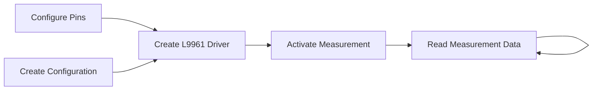

# STMicro L9961 Industrial Battery Management System Driver

This driver aims to provide a robust API for building battery packs utilizing the [STMicro L9961 BMS Chip](https://www.st.com/en/power-management/l9961.html).
The crate is built on top of the [`embedded-hal`](https://github.com/rust-embedded/embedded-hal) and [`embedded-hal-async`](https://github.com/rust-embedded/embedded-hal/tree/master/embedded-hal-async)  traits.

## Driver Design

The driver is built in two layers, the low-level register access layer and the high-level API layer.
Conversion logic for register codes is implemented in the conversions module.
The high level API uses standard units and converts to chip specific code units automatically.

The L9961 has a number of configuration options that can be set to customize the behavior of the chip.
These items can be configured at initialization, as well as on-the-fly and are stored in the configuration struct.
Configuration items that are determined by hardware configuration are enabled by feature flags:
- Cell count
  Enabling cells 4 and 5 add the corresponding measurement data to the measurement output
- NTC sensor
  Enabling the features adds the corresponding configuration to the configuration struct, and the corresponding measurement data to the measurement output

Typical usage of the driver will involve configuring the necessary pins and peripherals, creating a  configuration for the chip,
creating new instance of the driver, activating measurement, and then reading the measurement data in a loop.

## Register Information

The L9961 BMS chip has 48 registers, each with a unique address and definition.
The [register map](./register_info.md) provides the address, name, and layout of each register.
