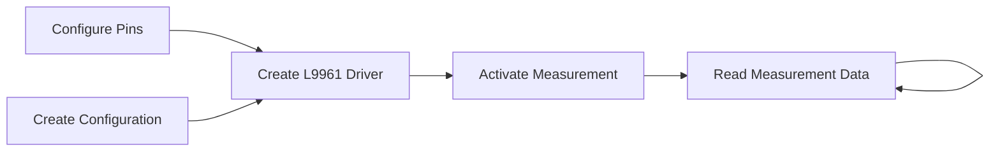

# STMicro L9961 Industrial Battery Management System Driver

This driver aims to provide a robust API for building battery packs utilizing the [STMicro L9961 BMS Chip](https://www.st.com/en/power-management/l9961.html).
The crate is built on top of the [`embedded-hal`](https://github.com/rust-embedded/embedded-hal) and [`embedded-hal-async`](https://github.com/rust-embedded/embedded-hal/tree/master/embedded-hal-async)  traits.
The driver requires an async runtime to function, and has been tested with both [Embassy](https://embassy.dev) as well as [RTIC 2.x](https://rtic.rs).

## Driver Design

The driver is built in two layers, the low-level register access layer and the high-level API layer.
Conversion logic for register codes is implemented in the conversions module.
The high level API uses standard units and converts to chip specific code units automatically.

The L9961 has a number of configuration options that can be set to customize the behavior of the chip.
These items can be configured at initialization, as well as on-the-fly and are stored in the configuration struct.
Configuration items that are determined by hardware configuration are enabled by feature flags:
- Cell count
  Enabling `4_cells` or `5_cells` features add the corresponding measurement data to the measurement output.
- NTC sensor
  Enabling the `ntc` feature adds the corresponding configuration to the configuration struct, and the corresponding measurement data to the measurement output.
- Coulomb counter
  Enabling the `coulomb_counting` feature adds the corresponding configuration to the configuration struct, and the corresponding measurement data to the measurement output.

## Usage

Typical usage of the driver will involve configuring the necessary pins and peripherals, creating a  configuration for the chip,
creating new instance of the driver, activating measurement, and then reading the measurement data in a loop.



```rust no_run
#![no_main]
#![no_std]
#![deny(warnings, unsafe_code)]

use embassy_executor::Spawner;
use embassy_time::Delay;
use l9961::{
    config::{CounterThreshold, VoltageThresholds},
    registers::{Cfg2Enables, FetConfig},
    Config,
};
use steval_l99615c::{configure_l9961, };

#[embassy_executor::main]
async fn main(_spawner: Spawner) -> ! {
    let peripherals = embassy_stm32::init(Default::default());

    let config = Config {
        // Configure the voltage monitoring with extreme thresholds to avoid faults triggering
        voltage_thresholds: VoltageThresholds {
            cell_over_voltage_threshold_mv: 4200,
            cell_severe_over_voltage_delta_threshold_mv: 100,
            cell_under_voltage_threshold_mv: 2900,
            cell_severe_under_voltage_delta_threshold_mv: 400,
            cell_balancing_under_voltage_delta_threshold_mv: 600,
            pack_over_voltage_threshold_mv: 20750,
            pack_under_voltage_threshold_mv: 15000,
            max_pack_cell_sum_delta_mv: 500,
            fault_counter_threshold: CounterThreshold::default(),
        },
        ..Default::default()
    };

    let mut l9961 = configure_l9961_peripherals(peripherals, config);

    let mut delay = Delay;
    l9961.wake_if_asleep(&mut delay).await;

    l9961.apply_config().await.unwrap();
    // Make sure measurements are disabled before changing settings
    l9961.disable_measurements().await.unwrap();

    // Configure cell and battery measurements
    let enables = Cfg2Enables::new(
        true,                // Enable cell 1 voltage measurement
        true,                // Enable cell 2 voltage measurement
        true,                // Enable cell 3 voltage measurement
        true,                // Enable cell 4 voltage measurement
        true,                // Enable cell 5 voltage measurement
        true,                // Enable Battery voltage measurement
        true,                // Enable temperature measurement
        true,                // Enable current measurement
        true,                // Enable coulomb counter
        false,               // Disable over-current detection
        false,               // Disable short-circuit detection
        FetConfig::HighSide, // Set the discharge FET configuration to high-side
        FetConfig::HighSide, // Set the charge FET configuration to high-side
        false,               // Disable data CRC
    );
    l9961.write_cfg2_enables(enables).await.unwrap();

    // Clear any faults that may have been triggered
    l9961.clear_all_faults().await.unwrap();
    // Start the measurement loop
    l9961.enable_measurements().await.unwrap();
    loop {
        let _measurement = l9961.make_measurement(&mut delay).await.unwrap();
        // Do cool stuff with measurement
    }
}

```

## Register Information

The L9961 BMS chip has 48 registers, each with a unique address and definition.
The [register map](./register_info.md) provides the address, name, and layout of each register.
